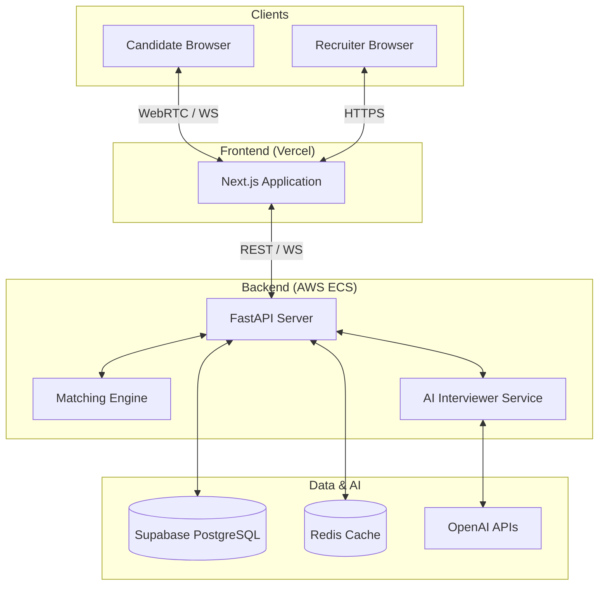

# 🤖 HireAI — AI Interviewer & Skill Assessment Platform

[](https://opensource.org/licenses/MIT)
[](https://fastapi.tiangolo.com/)
[](https://nextjs.org/)
[](https://openai.com/)
[](https://supabase.com/)

> **Production-grade autonomous recruitment platform** powered by GPT-4o, OpenAI Realtime API, WebRTC, and Supabase. Automate your entire hiring pipeline from resume screening to multi-round AI video interviews.

---

## ✨ Features

- **🧠 Resume Parsing & JD Matching:** High-precision analysis using LangChain + GPT-4o + pgvector.
- **🎙️ Real-Time Voice AI Interviews:** Immersive experience using OpenAI Realtime API (Speech-to-Speech).
- **📹 Video Streaming:** Robust peer-to-peer video connection via WebRTC.
- **📈 Live Candidate Scoring:** Real-time WebSocket analysis for immediate feedback.
- **🔄 Multi-Round Interview Engine:** State-controlled flow (Introduction → Technical → HR → Salary).
- **✉️ Automated Invites:** Fully integrated email workflows via AWS SES.
- **📄 Comprehensive Scorecards:** Detailed post-interview analysis and recruiter reports.
- **🖥️ Recruiter Dashboard:** Modern, high-performance UI built with Next.js 14 and Tailwind CSS.

---

## 🏗️ Architecture



---

## 🚀 Quick Start

### 📋 Prerequisites
- **Node.js 20+** & **npm/yarn**
- **Python 3.11+**
- **Docker** & **Docker Compose**
- **Supabase** Project
- **OpenAI API Key** (GPT-4o Access)

### 🛠️ Installation

```bash
# 1. Clone the repository
git clone https://github.com/rohan27795/-AI-Interviewer-Skill-Assessment-Platform.git
cd ai-interview

# 2. Setup Backend
cd backend
cp .env.example .env  # Update with your keys
pip install -r requirements.txt
uvicorn app.main:app --reload

# 3. Setup Frontend
cd ../frontend
npm install
cp .env.example .env.local  # Update with your keys
npm run dev
```

---

## 📁 Project Structure

```text
.
├── backend/                # FastAPI Application
│   ├── app/                # Core logic, API routes, services
│   ├── tests/              # Pytest suite
│   └── requirements.txt    # Python dependencies
├── frontend/               # Next.js 14 Application
│   ├── src/app/            # Pages and Layouts
│   ├── src/components/     # UI Components
│   └── public/             # Static assets
├── infra/                  # Infrastructure as Code
│   ├── supabase_schema.sql # Database schema
│   └── terraform/          # AWS Deployment scripts
└── docker-compose.yml       # Local development stack
```

---

## 🔒 Security & Privacy

- **JWT Authentication:** Secure stateless session management.
- **Row Level Security (RLS):** Data isolation at the database level via Supabase.
- **Secret Management:** Integration with AWS SSM/Secrets Manager for production.
- **Encryption:** S3 server-side encryption and restricted public access.
- **PII Protection:** Strict isolation policies for candidate personal information.

---

## 📝 License

Distributed under the **MIT License**. See `LICENSE` for more information.

---

Built with ❤️ for modern HR teams. Powered by **OpenAI**, **Next.js**, and **FastAPI**.